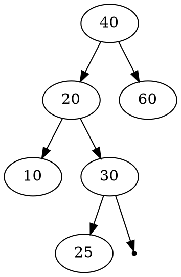
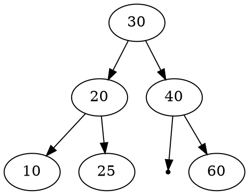

# AVL & BST Tree library
註: 本專案採用函數指標，使用者可自訂資料節點大小，關於指標函數請觀看func_ptr.md的說明  

作業網址: [https://hackmd.io/@chtsai/2020DS-homework-4](https://hackmd.io/@chtsai/2020DS-homework-4)

**AVL Tree 需要的節點結構:**
```c
typedef struct avl_node
{
    struct avl_node *left;
    struct avl_node *right;
    int height;
} avl_node_t;
```
**實作的函式**
```c=
avl_node_t *insert(void *element, avl_node_t *root, int (*compare)(void *, void *));
avl_node_t *Delete(void *element, avl_node_t *root, int (*compare)(void *, void *));
avl_node_t *find(void *element, avl_node_t *root, int (*compare)(void *, void *));

static avl_node_t *rotateright(avl_node_t *);
static avl_node_t *rotateleft(avl_node_t *);
static avl_node_t *RR(avl_node_t *);
static avl_node_t *LL(avl_node_t *);
static avl_node_t *LR(avl_node_t *);
static avl_node_t *RL(avl_node_t *);
static int height(avl_node_t *);
static int balanceFactor(avl_node_t *);
```
## 前言
其實 AVL tree 就是 Binary Search Tree的一種，更精確地來說，其實就是先按BST的方式操作後，再依據每一點的balance factor來看要怎麼整理(RR, LL, RL, LR)。  
這棵樹最厲害的地方就是，她維持了BST的特性，你會發現一顆整理前(也就是BST)與整理後(AVL Tree)，兩者的in order順序印出來是一樣的。  
在各種情況下，時間複雜度都是logN，以及透過整理，讓這棵樹不會長歪，同時資料的排序也是維持跟BST一樣。

## static函式 
外部無法存取這些函式，僅供內部使用
### 右旋(rotate right)
```c
static avl_node_t *rotateright(avl_node_t *node)
{
    avl_node_t *temp = node->left;

    node->left = temp->right;
    temp->right = node;

    node->height = height(node);
    temp->height = height(temp);

    return temp;
}
```

### 左旋(rotate left)
```c
static avl_node_t *rotateleft(avl_node_t *node)
{
    avl_node_t *temp = node->right;

    node->right = temp->left;
    temp->left = node;

    node->height = height(node);
    temp->height = height(temp);

    return temp;
}
```

### RR(插入在右子樹的右邊)
其實就是 rotate left
```c
static avl_node_t *RR(avl_node_t *node)
{
    return rotateleft(node);
}
```

### LL(插入在左子樹的左邊)
```c
static avl_node_t *LL(avl_node_t *node)
{
    return rotateright(node);
}
```

### LR(插入在左子樹的右邊)
先左轉再右轉
```c
static avl_node_t *LR(avl_node_t *node)
{
    node->left = rotateleft(node->left);
    return rotateright(node);
}
```

### RL(插入在右子樹的左邊)
先右轉再左轉
```c
static avl_node_t *RL(avl_node_t *node)
{
    node->right = rotateright(node->right);
    return rotateleft(node);
}
```

### 點的高度
第18行的寫法稱為"三元運算子"，可以參考[這篇](https://shengyu7697.github.io/blog/2019/12/27/Cpp-ternary-operator/)
```c=
static int height(avl_node_t *node)
{
    int height_left = 0;
    int height_right = 0;
    if (node == NULL)
    {
        return 0;
    }
    if (node->left)
    {
        height_left = height(node->left);
    }
    if (node->right)
    {
        height_right = height(node->right);
    }

    return height_right > height_left ? ++height_right : ++height_left;
}
```

### 更新樹根(root)以下所有點的高度
為了能夠更新樹根下所有點的高度，採用post-order(LRV)順序來更新
```c
static void update_node_height(avl_node_t *node)
{
    if (node->left)
        update_node_height(node->left);
    if (node->right)
        update_node_height(node->right);
    node->height = height(node);
}
```

### Balance Factor
AVL Tree一直強調的就是要怎麼不讓這棵樹長歪，就是要透過balance factor來修剪  
bf = 左子樹高度-右子樹高度
```c
static int balanceFactor(avl_node_t *node)
{
    return height(node->left) - height(node->right);
}
```

## 使用者可以呼叫使用的函式
### Insert
在第4行可以看到，先用BST那邊的插入函式進行插入的動作
之後更新每個點的高度，以及balance factor
接著若在root有發現bf>1或bf<-1的情形，採用recursive的方式，往下尋找，若尋找到-1<bf<1的點時，就會停止，且上一層的bf若不在合法範圍內，就會進到下方的整理區(LL, RR, LR, RL)，這樣一直往上，就會沿路整理，自然頂點root的bf就能落在合法區間內。
```c=
avl_node_t *insert(void *element, avl_node_t *root, int (*compare)(void *elementA, void *elementB))
{
    //BST insert node, note that the same value WILL NOT create the new node!!
    avl_node_t *node = (avl_node_t *)insertNode(element, (node_t *)root, compare);

    //Initial the height of node
    update_node_height(node);

    //Initial the parameter of balance factor
    int bf = balanceFactor(node);

    //for checking the element from bottom
    if ((bf > 1) || (bf < -1))
    {
        if (node->left)
            node->left = insert(NULL, node->left, compare);
        if (node->right)
            node->right = insert(NULL, node->right, compare);
    }

    //update the height of node
    update_node_height(node);

    //update the balance factor
    bf = balanceFactor(node);

    //LL
    if ((bf > 1) && (compare(element, node->left) == -1))
    {
        // printf("LL\n");
        return LL(node);
    }

    //RR
    if ((bf < -1) && (compare(element, node->right) == 1))
    {
        // printf("RR\n");
        return RR(node);
    }

    //LR
    if ((bf > 1) && (compare(element, node->left) == 1))
    {
        // printf("LR\n");
        return LR(node);
    }

    //RL
    if ((bf < -1) && (compare(element, node->right) == -1))
    {
        // printf("RL\n");
        return RL(node);
    }

    return node;
}
```

### Delete
跟BST一樣刪法，刪完之後檢查有沒有長歪，長歪的話就進行修剪  
這邊下方決定要如何調整(如LL與LR)，是用node->left該點的傾斜情形(bf)，來決定如何調整
```c=
avl_node_t *Delete(void *element, avl_node_t *node, int (*compare)(void *, void *))
{
    //BST delete node
    if (deleteNode(element, (node_t *)node, compare) == NULL)
        return NULL;
    node->height = height(node);
    int bf = balanceFactor(node);

    if ((bf > 1) || (bf < -1))
    {
        if (node->left)
            Delete(NULL, node->left, compare);
        if (node->right)
            Delete(NULL, node->right, compare);
    }

    //LL
    if ((bf > 1) && (balanceFactor(node->left) >= 0))
        return LL(node);

    //RR
    if ((bf < -1) && (balanceFactor(node->right) <= 0))
        return RR(node);

    //LR
    if ((bf > 1) && (balanceFactor(node->left) <= 0))
    {
        return LR(node);
    }

    //RL
    if ((bf < -1) && (balanceFactor(node->right) > 0))
    {
        return RL(node);
    }

    return node;
}
```

### Find
沒錯，find過程完全跟BST一樣，因為只是找點沒有動到結構，就不需特地整理了  
如果想要幫他整理，那就用insert那邊，給他插入NULL(element欄位)就好了
```c
avl_node_t *find(void *element, avl_node_t *node, int (*compare)(void *elementA, void *elementB))
{
    return (avl_node_t *)findNode(element, (node_t *)node, compare);
}
```

## Demo
### 自訂結構，比較函式與印出元素函式
```c
typedef struct myElement
{
    avl_node_t node;
    char ID[11];
    int math;
    int eng;
} student_t;

student_t *root = NULL;

int compareMath(void *elementA, void *elementB)
{
    int mathA = ((student_t *)elementA)->math;
    int mathB = ((student_t *)elementB)->math;
    if (mathA > mathB)
    {
        return 1;
    }
    if (mathA < mathB)
    {
        return -1;
    }
    else
        return 0;
}

void print(void *element)
{
    student_t *temp = (student_t *)element;
    printf("id=%s, math=%d, english=%d\n", temp->ID, temp->math, temp->eng);
}
```
### 宣告節點並將值輸入進去
```c
student_t node0, node1, node2, node3, node4, node5;

strcpy(node0.ID, "C120308001");
node0.math = 40;
node0.eng = 100;

strcpy(node1.ID, "B220406001");
node1.math = 20;
node1.eng = 90;

strcpy(node2.ID, "D120306001");
node2.math = 60;
node2.eng = 95;

strcpy(node3.ID, "A220407001");
node3.math = 10;
node3.eng = 90;

strcpy(node4.ID, "D220506001");
node4.math = 30;
node4.eng = 70;

strcpy(node5.ID, "A120406001");
node5.math = 25;
node5.eng = 90;
```

### 採用BST的印出結果
樹狀圖中的點都是數學成績




### 採用AVL Tree的印出結果


###### tags: `DS` `AVL Tree` `BST`
