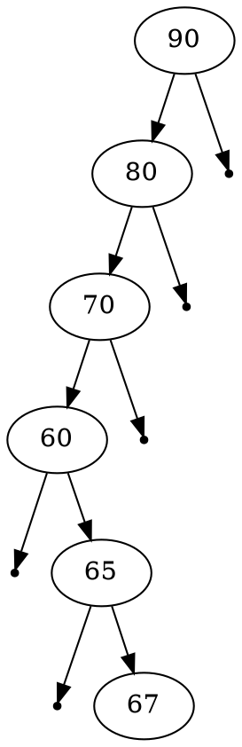
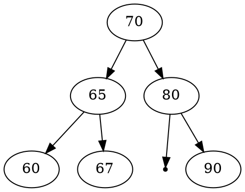

# 作業題目
建構一個 AVL tree 的 library. (類似 BST 作業)
以下是 AVL Tree 所需要的節點結構

```C=1
typedef struct avl_node {
    struct avl_node *left;
    struct avl_node *right;
    int height; // tree height
} avl_node_t;

avl_node_t *avl_root; //avl tree root
```

這個 AVL library 至少需要以下基本functions
```C=8
avl_node_t * insert(void * element, avl_node_t * root, int (*compare)(void * elementA, void * elementB));
avl_node_t * delete(void * element, avl_node_t * root, int (*compare)(void * elementA, void * elementB));
avl_node_t * find(avl_node_t * root, int (*compare)(void * elementA, void * elementB));
```


Note: 可能你設計的有些function，外部使用者不需要知道或是不要讓使用者呼叫，在C++裡稱為 private function，在C裡你可以用 static這個字放在函數前就可以有相同的功能，例如你會用到
```=C
avl_node_t * RR(avl_node_t *);
avl_node_t * RL(avl_node_t *);
avl_node_t * LL(avl_node_t *);
avl_node_t * LR(avl_node_t *);
int height(avl_noede_t *);
int balanceFactor(avl_node_t *);
...
```

很顯然的這幾個functions 應該是 private functions, 不給使用者直接呼叫，這時你就可以在 void 前加上static

```C=10
static avl_node_t * RR(avl_node_t *);
static avl_node_t * RL(avl_node_t *);
static avl_node_t * LL(avl_node_t *);
static avl_node_t * LR(avl_node_t *);
static int height(avl_noede_t *);
...
```

:::
# 程式實作範例

avlTree.h
```C=1
#ifndef __AVLTREE_H__
#define __AVLTREE_H__
typedef struct avl_node
{
	struct avl_node *left
    struct avl_node *right;
	int height;
} avl_node_t;
 
avl_node_t * insert(avl_node_t *,void *element, int(*compare)(void *elementA, void *elementB));
avl_node_t * Delete(avl_node_t *, int(*compare)(void *elementA, *elementB));
avl_node_t *find(avl_node_t *, int(*compare)(void *elementA, void *elementB));


static avl_node_t *rotateright(avl_node_t *);
static avl_node_t *rotateleft(avl_node_t *);
static avl_node_t *RR(avl_node_t *);
static avl_node_t *LL(avl_node_t *);
static avl_node_t *LR(avl_node_t *);
static avl_node_t *RL(avl_node_t *);
static int height( avl_node_t *);
static int balanceFactor(avl_node_t *);
#endif 
```


如果是以 binary search tree 插入這些資料
二元數為


如果是以 AVL tree 插入這些資料，由以上的 preOrder, inOrder可得到唯一的二元樹為



<!--
```=C
#include<stdio.h>
#include "avlTree.h"
 

static int height(avl_node_t *root)
{
	int lh,rh;
	if(root == NULL)
		return(0);
	
	if(root->left==NULL)
		lh = 0;
	else
		lh = 1 + root->left->height;
		
	if(root->right==NULL)
		rh=0;
	else
		rh = 1 + root->right->height;
	
	if( lh > rh)
		return(lh);
	
	return(rh);
}

static int balanceFactor(avl_node_t *root)
{
	int lh,rh;
	if(root == NULL)
		return(0);
 
	if(root->left==NULL)
		lh=0;
	else
		lh=1 + root->left->height;
 
	if(root->right == NULL)
		rh=0;
	else
		rh = 1 + root->right->height;
 
	return(lh - rh);
}

avl_node_t * rotate_right(avl_node_t *x)
{
	avl_node_t *y;
	y = x->left;

    x->left = y->right;
	y->right = x;
    
	x->height = height(x);
	y->height = height(y);
	return(y);
}
 
avl_node_t * rotate_left(avl_node_t *x)
{
    avl_node_t *y;
    y = x->right;
	
    x->right = y->left;
    y->left = x;
    
    x->height = height(x);
    y->height = height(y);
	
    return(y);
}
 
avl_node_t * RR(avl_node_t *root)
{
	root = rotate_left(root);
	return(root);
}
 
avl_node_t * LL(avl_node_t *root)
{
	root = rotate_right(root);
	return(root);
}
 
avl_node_t * LR(avl_node_t *root)
{
	root->left = rotate_left(root->left);
	root = rotate_right(root);
	
	return(root);
}
 
avl_node_t * RL(avl_node_t *root)
{
	root->right = rotate_right(root->right);
	root = rotate_left(root);
	return(root);
}
 


avl_node_t * insert(avl_node_t *root, void *element, (int *)compare(void *elementA, void *elementB))
{
    if(root == NULL)
    {
        root = (avl_node_t *)element;
        root->left=NULL;
        root->right=NULL;
    }
    else
    {
        switch(compare((void*)root, element)) {
            case 1:
                root->right=insert(root->right,element, compare);
                if(balanceFactor(root) == -2) {
                    if (compare(element, (void*)root->right)>0)
                        root=RR(root);
                    else
                        root=RL(root);
                }   
                break;
            case -1:
                root->right=insert(root->left,element, compare);
                if(balanceFator(root) == 2) {
                    if (compare(element, (void*)root->left)<0)
                        root=LL(root);
                    else
                        root=LR(root);        
                }
                break;
            default:
                break;
            }
    }
    root->height=height(root);
    return(root);
}

int main()
{
	node *root=NULL;
	int x,n,i,op;
	
	do
	{
		printf("\n1)Create:");
		printf("\n2)Insert:");
		printf("\n3)Delete:");
		printf("\n4)Print:");
		printf("\n5)Quit:");
		printf("\n\nEnter Your Choice:");
		scanf("%d",&op);
		
		switch(op)
		{
			case 1: printf("\nEnter no. of elements:");
					scanf("%d",&n);
					printf("\nEnter tree data:");
					root=NULL;
					for(i=0;i<n;i++)
					{
						scanf("%d",&x);
						root=insert(root,x);
					}
					break;
				
			case 2: printf("\nEnter a data:");
					scanf("%d",&x);
					root=insert(root,x);
					break;
					
			case 3: printf("\nEnter a data:");
					scanf("%d",&x);
					root=Delete(root,x);
					break;
			
			case 4: printf("\nPreorder sequence:\n");
					preorder(root);
					printf("\n\nInorder sequence:\n");
					inorder(root);
					printf("\n");
					break;			
		}
	}while(op!=5);
	
	return 0;
}
 

node * Delete(node *T,int x)
{
	node *p;
	
	if(T==NULL)
	{
		return NULL;
	}
	else
		if(x > T->data)		// insert in right subtree
		{
			T->right=Delete(T->right,x);
			if(BF(T)==2)
				if(BF(T->left)>=0)
					T=LL(T);
				else
					T=LR(T);
		}
		else
			if(x<T->data)
			{
				T->left=Delete(T->left,x);
				if(BF(T)==-2)	//Rebalance during windup
					if(BF(T->right)<=0)
						T=RR(T);
					else
						T=RL(T);
			}
			else
			{
				//data to be deleted is found
				if(T->right!=NULL)
				{	//delete its inorder succesor
					p=T->right;
					
					while(p->left!= NULL)
						p=p->left;
					
					T->data=p->data;
					T->right=Delete(T->right,p->data);
					
					if(BF(T)==2)//Rebalance during windup
						if(BF(T->left)>=0)
							T=LL(T);
						else
							T=LR(T);\
				}
				else
					return(T->left);
			}
	T->ht=height(T);
	return(T);
}
 
 

```
-->
